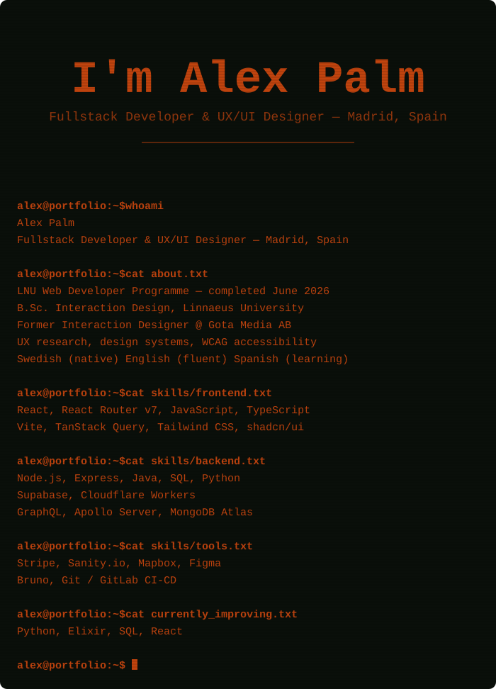

## Projects

---

## The Idle Game
An agentic coding experience. This one's less about the end product and more about the process — using AI tooling as a real development partner to explore two things at once: the fundamentals of building a game in a genre I genuinely love, and how to work with AI effectively as part of a development workflow rather than just as an autocomplete.

---

## Party with Me
A client-delivered web app built as my final capstone project for the LNU Web Developer Programme, developed for client Max Karlsson at Hyperlane.
- **Frontend:** React Router v7, Tailwind CSS, shadcn/ui
- **Backend / Data:** Supabase (auth + database), Sanity.io (content), Cloudflare Workers (edge functions)
- **Integrations:** Stripe for payments, Mapbox for location features
- Delivered end-to-end for a real external client, including a full academic report documenting architecture decisions and ethical considerations.

---

## World Cup 2026 Dashboard
A live tournament tracking dashboard built around a dual-source adapter architecture — it defaults to a static openfootball dataset and can swap to a live WC2026 API source without changing the UI layer.
- **Stack:** React, Vite, TypeScript, TanStack Query, Tailwind v4
- Displays match times converted to Madrid's local timezone
- Uses a serverless edge function as a proxy layer between the frontend and the live data source

---

## Bambu Lab A1 Mini Dashboard
A custom monitoring dashboard for my 3D printer, built by reverse-engineering the printer's own MQTT, FTP, and camera interfaces rather than relying on official tooling.
- **Stack:** Python backend, streaming live data to the frontend over WebSocket
- Exploring adding a Raspberry Pi Zero 2 W with a Camera Module 3 to get smoother live video via MediaMTX/WebRTC

---

## GraphQL Climate API
A GraphQL API serving a large historical climate dataset (200k+ readings from the Berkeley Earth dataset).
- **Stack:** Node.js, Apollo Server, MongoDB Atlas
- JWT-based authentication
- Automated API testing with Bruno CLI, wired into a GitLab CI/CD pipeline

---

## ClimateDB Frontend
The companion React frontend for the Climate API, styled with a dark "scientific observatory" aesthetic.
- **Stack:** TypeScript, Vite, Apollo Client, Recharts
- Built using Atomic Design component structure for a scalable, reusable component library

---

## IoT Temperature Monitor
A small embedded project reading live environmental data.
- **Hardware:** Raspberry Pi Pico W with DHT/BMP sensors
- Serves live temperature and pressure readings over a lightweight web server
- Includes LiPo battery power management for untethered operation

---

## Contact

- Email: Alex.cj.palm@proton.me
- LinkedIn: https://www.linkedin.com/in/alex-carl-johan-palm/
